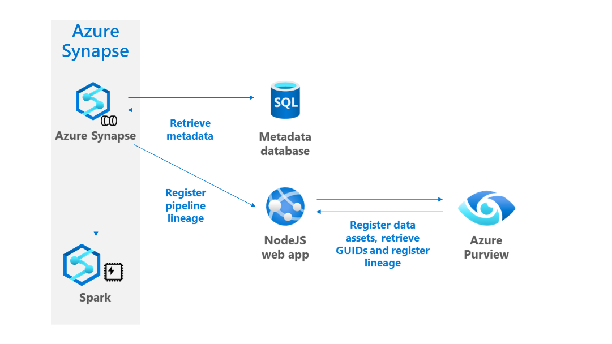
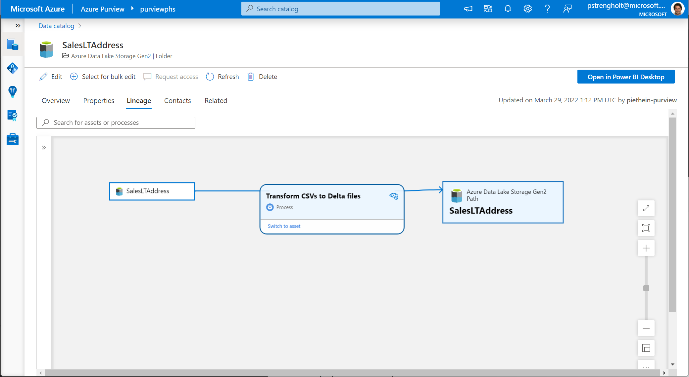

# Register lineage in Purview

This repo contains a small web application for easily registering lineage in Purview. It addresses some of the overhead when integrating with Azure Purview. For example, integrating your data pipelines using Purview's APIs isn't easy. First, you need to authenticate. Second, you need to validate whether assets already exist. You might want to cleanup things and need to retrieve the unique identifiers for creating lineage objects. For reducing this overhead, I've decided to put together a small web app that takes arguments from your data pipelines, looks up the data assets, cleans up, and performs a registration of source, target and a lineage process step. So instead of calling Azure Purview, you will call a web app that handles all of this.

## Setup & Demo Flow

This gives a short, high-level overview of how this repo may be used.



In order to deploy this NodeJS web app you need to have the following:

* Both Node.js and npm installed. Run the command node --version to verify that Node.js is installed.
* [Visual Studio Code](https://code.visualstudio.com/) installed
* The [Azure App Service extension for Visual Studio Code](https://marketplace.visualstudio.com/items?itemName=ms-azuretools.vscode-azureappservice) installed
* Clone the purview-nodejs-lineage-registration repository 
* Copy [sample.env](./sample.env) to .env
* Within .env, modify the following parameters: ENDPOINT, AZURE_CLIENT_SECRET, AZURE_CLIENT_ID and AZURE_TENANT_ID
* Run the following commands:

```
npm install
npm start
```

Open http://localhost:8080, and verify your application is running. When you see a welcome message, deploy your web app to Azure by following these steps:

1. In the App Service explorer, within VSCode, select the Deploy to Web App icon.
2. Select Create new Web App. A Linux container is recommended.
3. Type a globally unique name for your web app and press Enter.
4. In Select a runtime stack, select the Node.js version 16 LTS.
5. In Select a pricing tier, select Free (F1) and wait for the resources to be provisioned in Azure.
6. In the popup Always deploy the workspace "myExpressApp" to <app-name>", select Yes.
7. While Visual Studio Code provisions the Azure resources and deploys the code, it shows progress notifications.
8. Once deployment completes, select Browse Website in the notification popup. The browser should display the welcome page.

To validate the deployment, you can try out and use Postman for submitting your first lineage registration. Within the repository, there's a [sample.json](./sample.json) message. With a single POST API call, it registers a source, target and lineage process step. When everything works as expected, you should see a Status 200 message.

